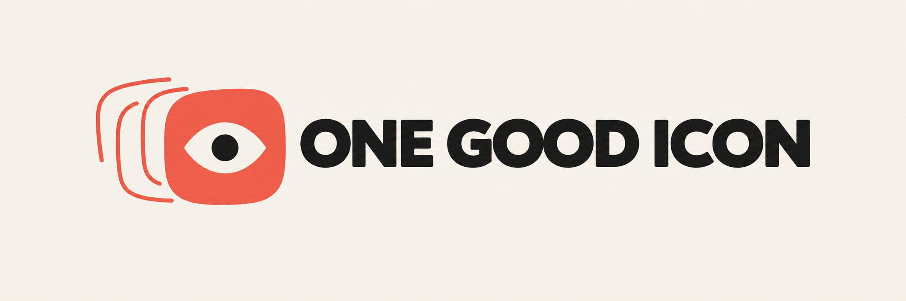

# One Good Icon



> Explore many. Ship one good icon.

One Good Icon is an agent skill for the complete app-icon cycle: divergent exploration from real product material, specialist critique at real sizes and in context, then platform-ready delivery for Apple, Android, and Expo.

## What makes it different

- **Real material first.** Product, UI, brand, screenshots, sketches, references, existing icons, and selected generations are first-class inputs.
- **Three human-gated phases.** Explore → Refine → Ship. A generated favorite is not silently promoted into production.
- **Native visual exploration.** The agent uses its host's image generator when available, with portable prompts as the fallback.
- **Concrete criticism.** It diagnoses visible failures instead of inventing a score.
- **Representation follows the artwork.** Vector reconstruction, raster masters, and layered Icon Composer sources are choices, not dogma.
- **Self-contained workflow.** One Good Icon replaces external icon-generation skills and API-backed CLIs; MAYA, Taste, Impeccable, or prototype can still offer an optional second opinion.

## Install

Run these commands from the repository root.

For development, link the checkout so changes are available immediately:

```bash
mkdir -p "${CODEX_HOME:-$HOME/.codex}/skills"
ln -s "$(pwd)" "${CODEX_HOME:-$HOME/.codex}/skills/one-good-icon"
```

For a standalone copy instead:

```bash
ONE_GOOD_ICON_DIR="${CODEX_HOME:-$HOME/.codex}/skills/one-good-icon"
mkdir -p "$ONE_GOOD_ICON_DIR"
cp -R SKILL.md agents assets references "$ONE_GOOD_ICON_DIR/"
```

If the destination already exists, update or remove that installation before running the command again. Start a new Codex task, then verify the skill with:

> Use `$one-good-icon` to explore an app icon and stop after the exploration board.

## Companion: MAYA

[MAYA](https://github.com/florianrumigny/maya) can own the wider product art direction, visual exploration, and global critique while One Good Icon owns the specialist app-icon workflow. This integration is optional; One Good Icon works on its own.

## Repository map

```text
SKILL.md                 compact workflow and routing
agents/openai.yaml       Codex-facing metadata
assets/                  logo lockup and skill-avatar marks
references/explore.md    divergence and reference handling
references/refine.md     variation and test protocol
references/critic.md     specialist review lens
references/ship.md       production decision and final verification
references/apple.md      Apple/Icon Composer adapter
references/android-expo.md Android and Expo adapter
references/sources.md    audited sources and derived principles
ARCHITECTURE.md          scope, authority, and extension model
tests/fixtures/          a provider-neutral dry-run brief
```

## Current status

This MVP defines and validates the agent workflow. It does not bundle a generator, require cloud credentials, or hide platform-tool availability. Platform commands and formats are checked at run time because Apple, Android, and Expo tooling evolve.

The identity turns “icon” into a small visual joke: a single eye-con emerges from the visible remains of several iterations. The full lockup belongs in documentation; the skill avatar keeps only the eye and iteration contours.

## Try it

Install or link the folder as a Codex skill, then invoke it with real material:

> Use `$one-good-icon` to explore an app icon for this product. Here are the product brief, three screenshots, the brand palette, and two visual references. Stop after the exploration board.

For a low-risk dry run, use `tests/fixtures/pocket-tide.md` and ask the skill to complete Explore only.
